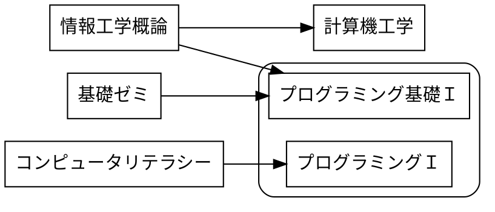

# 課題 B4.1

## 情報工学科1年

```dot
digraph {
    rankdir = LR
    node [shape=box]
    ICS [label=情報工学概論]
    CE [label=計算機工学]
    ASS [label=基礎ゼミ]
    CL [label=コンピュータリテラシー]
    ICS -> PP1
    ICS -> CE
    ASS -> PP1
    CL -> P1
    subgraph clusterP {
        style=rounded
        PP1 [label=プログラミング基礎Ｉ]
        P1 [label=プログラミングＩ]
     }
}
```
