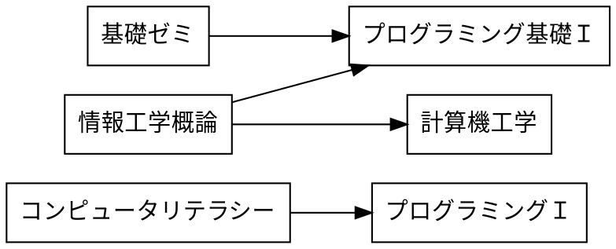

# 課題

## 課題 4．1 有向グラフ


プレビュー結果が上の図のようになるように，下記の記述を完成させよ．



## 課題 4.2 WBS


プレビュー結果が上の図のようになるように，下記の記述を完成させよ．(色や影などの違いは気にしなくてよい)

```plantUML
@startwbs ex02
* 拓殖大学
** 商学部
*** 経営学科
*** 国際ビジネス学科
*** 会計学科
** 政経学部
*** 法律政治学科
*** 経済学科
** 外国語学部
*** 英米語学科
*** 中国語学科
*** スペイン語学科
*** 国際日本語学科
*** 中国語学科
** 工学部
*** 機械システム工学部
*** 電子システム工学部
*** 情報工学科
*** デザイン学科
** 国際学部
*** 国際学科
@endwbs
```

## 課題 4.3 ユースケース図


プレビュー結果が上の図のようになるように，下記の記述を完成させよ．ただし，別名については適当に設定してよい．(色や影などの違いは気にしなくてよい)

```plantUML {code_block}
@startuml ex03
left to right direction
actor 学生 as student
actor 教員 as faculty
rectangle {
    usecase "課題の登録" as uc1
    usecase "課題の受領" as uc2
    usecase "リポジトリのクローン" as uc3
    usecase "課題ファイルの修正" as uc4
    usecase "修正をステージに上げる" as uc5
    usecase "修正をコミットする" as uc6
    usecase "リモートリポジトリにpushする" as uc7
    usecase "リポジトリに提出された結果の確認" as uc8
}
uc1 <-- faculty
student --> uc2
student --> uc3
student --> uc4
student --> uc5
student --> uc6
student --> uc7
uc8 <-- faculty
@enduml
```

## 課題 4.4 アクティビティ図


プレビュー結果が上の図のようになるように，下記の記述を完成させよ．(色や影などの違いは気にしなくてよい)

```plantUML {code_block}
@startuml ex04
start
:正の整数を入力する;
if (入力値が偶数?) then (yes)
    :「偶数」と出力;
else (no)
    :「奇数」と出力;
endif
stop
@enduml
```
