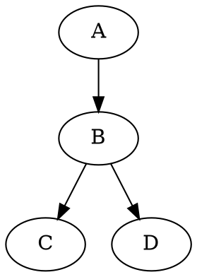
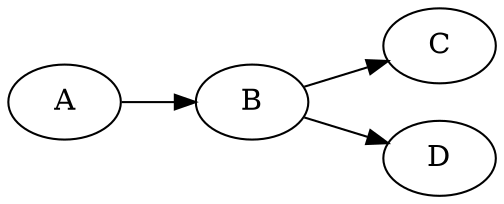
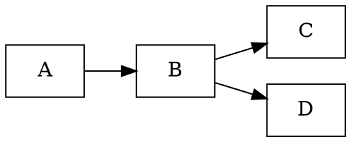

# Graphviz

```dot {code_block}
digraph {
    A -> B
    B -> C
    B -> D
}
```

```dot {code_block}
digraph {
    rankdir="LR"
    A -> B
    B -> C
    B -> D
}
```

```dot {code_block}
digraph {
    rankdir="LR"
    node [shape=box]
    A -> B
    B -> C
    B -> D
}
```
