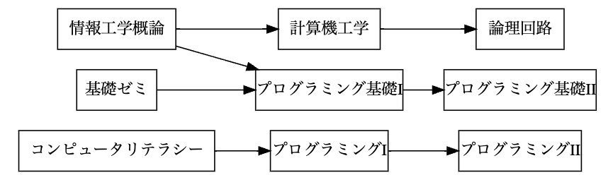
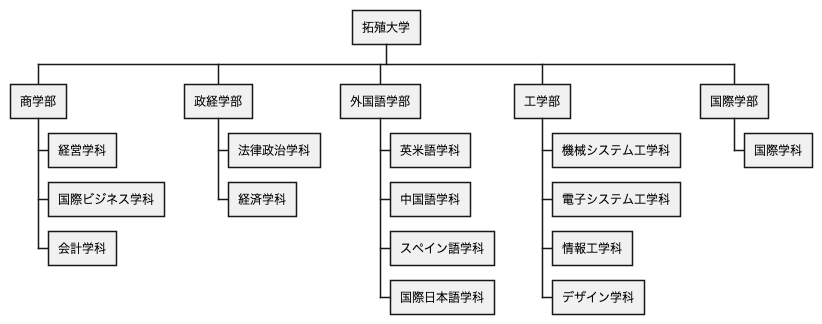
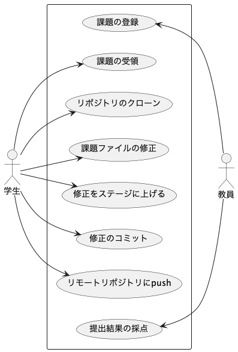
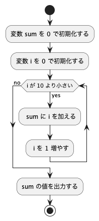

# 課題

## 課題 4.1 有向グラフ



プレビュー結果が上の図のようになるように，下記の記述を完成させよ．


## 課題 4.2 WBS



プレビュー結果が上の図のようになるように，下記の記述を完成させよ．(色や影などの違いは気にしなくてよい)

```plantUML {code_block}
@startwbs ex02
* 拓殖大学
** 商学部
@endwbs
```

## 課題 4.3 ユースケース図



プレビュー結果が上の図のようになるように，下記の記述を完成させよ．ただし，別名については適当に設定してよい．(色や影などの違いは気にしなくてよい)

```plantUML {code_block}
@startuml ex03
left to right direction
actor 学生 as student
rectangle {
    usecase "課題の受領" as uc2
}
student --> uc2
@enduml
```

## 課題 4.4 アクティビティ図



プレビュー結果が上の図のようになるように，下記の記述を完成させよ．(色や影などの違いは気にしなくてよい)

```plantUML {code_block}
@startuml ex04
start
stop
@enduml
```
