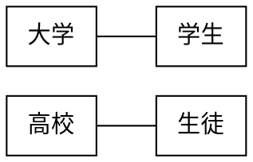
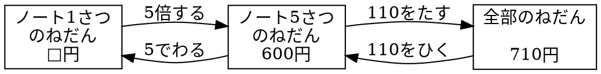

# 記述例

## Graphviz

### 図 4.1 無向グラフ



### 図 4.2 有向グラフ(単方向)

```graphviz {code_block}
digraph {
    rankdir="LR";
    node [shape=box];
    雨 -> 曇り;
    寝坊 -> 遅刻;
}
````

### 図 4.3 有向グラフ(双方向)

```graphviz {code_block}
digraph {
    rankdir="LR";
    node [shape=box];
    日本 -> 中国;
    中国 -> 日本;
    商店 -> 客;
    客 -> 商店;
    D企業 -> S企業 [dir=both];
}
```

### 図 4.4 関係図



### 図 4.5 WBS

```plantUML {code_block}
@startwbs uml01
* UML 2.0 
** 構造に関する表記
*** クラス図
*** オブジェクト図
*** パッケージ図
*** コンポジット構造図
*** コンポーネント図
*** 配置図
** 振舞いに関する表記
*** ユースケース図
*** アクティビティ図
*** 状態マシン図
*** シーケンス図
*** コミュニケーション図
*** 相互作用概要図
*** タイミング図
@endwbs
```

### 図 4.6 ユースケース図

```plantUML {code_block}
@startuml usecase01
left to right direction
actor "学生" as student
actor "教員" as faculty
rectangle 履修管理システム {
    usecase "成績を確認する" as chkgrd
    usecase "成績を入力する" as setgrd
    usecase "時間割を確認する" as chktbl
    usecase "履修者名簿を取得する" as getlist
    usecase "履修登録をする" as regist
}
student --> regist
getlist <-- faculty
student --> chktbl
setgrd <-- faculty
student --> chkgrd
@enduml
```

### 図 4.7 アクティビティ図

```plantUML {code_block}
@startuml activity01
start
:メーラを起動する;
while (メールをチェック) is (未読メール有)
    :メールを読む;
    if (返事が必要?) then (yes)
        :返事を書く;
    else (no)
    endif
endwhile (未読メール無)
:メーラを終了する;
stop
@enduml
```

### 図 4.8 WBS

```plantUML {code_block}
@startwbs wbs01
* プレゼンテーション
** 準備
*** マインドマップ
*** 絵コンテ
*** 情報収集
** スライド作成
*** テキスト入力
*** 図表の挿入
*** レイアウト
** リハーサル
*** 時間の確認
*** スライドの修正
** 発表
*** 発表
*** 質疑応答
@endwbs
```
